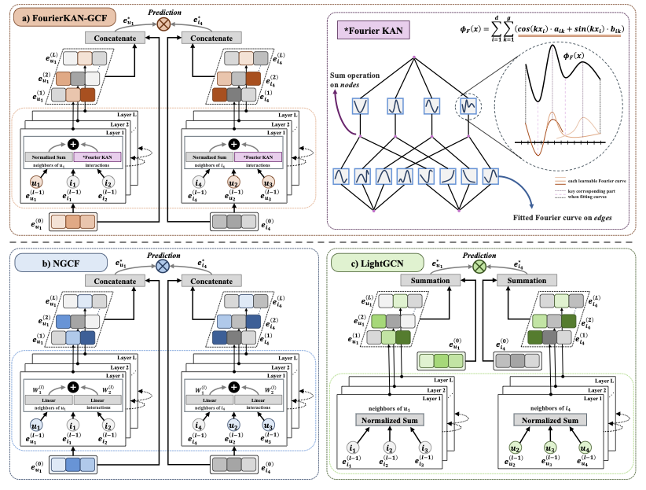

# FourierKAN-GCF: Fourier Kolmogorov-Arnold Network - An Effective and Efficient Feature Transformation for Graph Collaborative Filtering

<!-- PROJECT LOGO -->

## Introduction

This is the Pytorch implementation for our FourierKAN-GCF [paper](https://arxiv.org/abs/2406.01034):

>FourierKAN-GCF: Fourier Kolmogorov-Arnold Network - An Effective and Efficient Feature Transformation for Graph Collaborative Filtering

## Discussion

Rethinking feature transformation component in GCNs in recommendation field!

[LightGCN](https://arxiv.org/pdf/2002.02126) simplifies [NGCF](https://arxiv.org/pdf/1905.08108) by remove feature transformation, formally:

**NGCF**
```math
\begin{aligned} \mathbf{e}_u^{(l+1)} & =\sigma(\mathbf{W}_1 \mathbf{e}_u^{(l)}+\sum_{i \in \mathcal{N}_u} \frac{\mathbf{W}_1 \mathbf{e}_i^{(l)}+\mathbf{W}_2(\mathbf{e}_i^{(l)} \odot \mathbf{e}_u^{(l)})}{\sqrt{|\mathcal{N}_u||\mathcal{N}_i|}}), \\ \mathbf{e}_i^{(l+1)} & =\sigma(\mathbf{W}_1 \mathbf{e}_i^{(l)}+\sum_{u \in \mathcal{N}_i} \frac{\mathbf{W}_1 \mathbf{e}_u^{(l)}+\mathbf{W}_2(\mathbf{e}_u^{(l)} \odot \mathbf{e}_i^{(l)})}{\sqrt{|\mathcal{N}_u||\mathcal{N}_i|}}).
\end{aligned}
```
**LightGCN**
```math
\mathbf{e}_u^{(l+1)} =\sum_{i \in \mathcal{N}_u} \frac{\mathbf{e}_i^{(l)}}{\sqrt{|\mathcal{N}_u||\mathcal{N}_i|}}, \quad \mathbf{e}_i^{(l+1)} =\sum_{u \in \mathcal{N}_i} \frac{\mathbf{e}_u^{(l)}}{\sqrt{|\mathcal{N}_u||\mathcal{N}_i|}}.
```
We point out that $\mathbf{W}_1$ is unnecessary, but interaction part $\mathbf{W}_2(\mathbf{e}_i^{(l)} \odot \mathbf{e}_u^{(l)})$ is valuable for recommendation task, but it's hard to train on sparsity dataset.

Thanks to the original implementations [KAN](https://github.com/KindXiaoming/pykan) and [FourierKAN](https://github.com/GistNoesis/FourierKAN).

We use single-layer FourierKAN to replace MLP in feature transformation component and achieve better results than LightGCN and NGCF on MOOC and Amazon Games datasets. Formally:

**FourierKAN-GCF**
```math
\phi_F(\mathbf{x})=\sum_{i=1}^{d} \sum_{k=1}^{g}\left(\cos \left(k \mathbf{x}_i\right) \cdot a_{i k}+\sin \left(k \mathbf{x}_i\right) \cdot b_{i k}\right).
```
```math
\begin{aligned} \mathbf{e}_u^{(l+1)} & =\sigma(\mathbf{e}_u^{(l)}+\sum_{i \in \mathcal{N}_u} \frac{\mathbf{e}_i^{(l)}+\phi_F(\mathbf{e}_i^{(l)} \odot \mathbf{e}_u^{(l)})}{\sqrt{|\mathcal{N}_u||\mathcal{N}_i|}}), \\ \mathbf{e}_i^{(l+1)} & =\sigma(\mathbf{e}_i^{(l)}+\sum_{u \in \mathcal{N}_i} \frac{\mathbf{e}_u^{(l)}+\phi_F(\mathbf{e}_u^{(l)} \odot \mathbf{e}_i^{(l)})}{\sqrt{|\mathcal{N}_u||\mathcal{N}_i|}}).
\end{aligned}
```

**More datasets are yet to be tested, and this work is just a taste of whether KAN can be used for recommendation.**

## Structure


## Environment Requirement

- Python 3.9
- Pytorch 2.1.0

## Dataset

Two public datasets: MOOC, Games

## Training
  ```
  cd ./src
  python main.py
  ```

## Additional Feature Transformation Techniques

We have incorporated additional feature transformation techniques such as polynomial features, wavelet transforms, and autoencoders. These techniques are implemented in `models/common/layers.py`.

### Polynomial Features
Polynomial features are used to create new features by raising existing features to a power. This can help capture non-linear relationships in the data.

### Wavelet Transforms
Wavelet transforms are used to decompose a signal into different frequency components. This can help capture both time and frequency information in the data.

### Autoencoders
Autoencoders are neural networks used to learn efficient representations of the data. They can be used for dimensionality reduction and feature extraction.

## Configuration

The configuration files for datasets and models are located in the `configs` directory. Here is an example configuration for using the new feature transformation techniques:

```yaml
embedding_size: 64
hidden_size_list: [64,64,64]
reg_weight: [1]
n_layer: [2, 3]
grid_size: [1, 2, 4, 8]
dropout_node: [0.0, 0.1, 0.2, 0.3]
dropout_message: [0.0, 0.1, 0.2, 0.3]
polynomial_features: [True, False]
wavelet_transform: [True, False]
autoencoder: [True, False]
hyper_parameters: ["reg_weight", "grid_size", "dropout_node", "dropout_message", "n_layer", "polynomial_features", "wavelet_transform", "autoencoder"]
```

## Citing if this repo. useful:

```
@article{xu2024fourierkangcf,
  title={FourierKAN-GCF: Fourier Kolmogorov-Arnold Network -- An Effective and Efficient Feature Transformation for Graph Collaborative Filtering},
  author={Xu, Jinfeng and Chen, Zheyu and Li, Jinze and Yang, Shuo and Wang, Hewei and Hu, Xiping and Ngai, Edith C-H},
  journal={arXiv preprint arXiv:2406.01034},
  year={2024}
}
```

